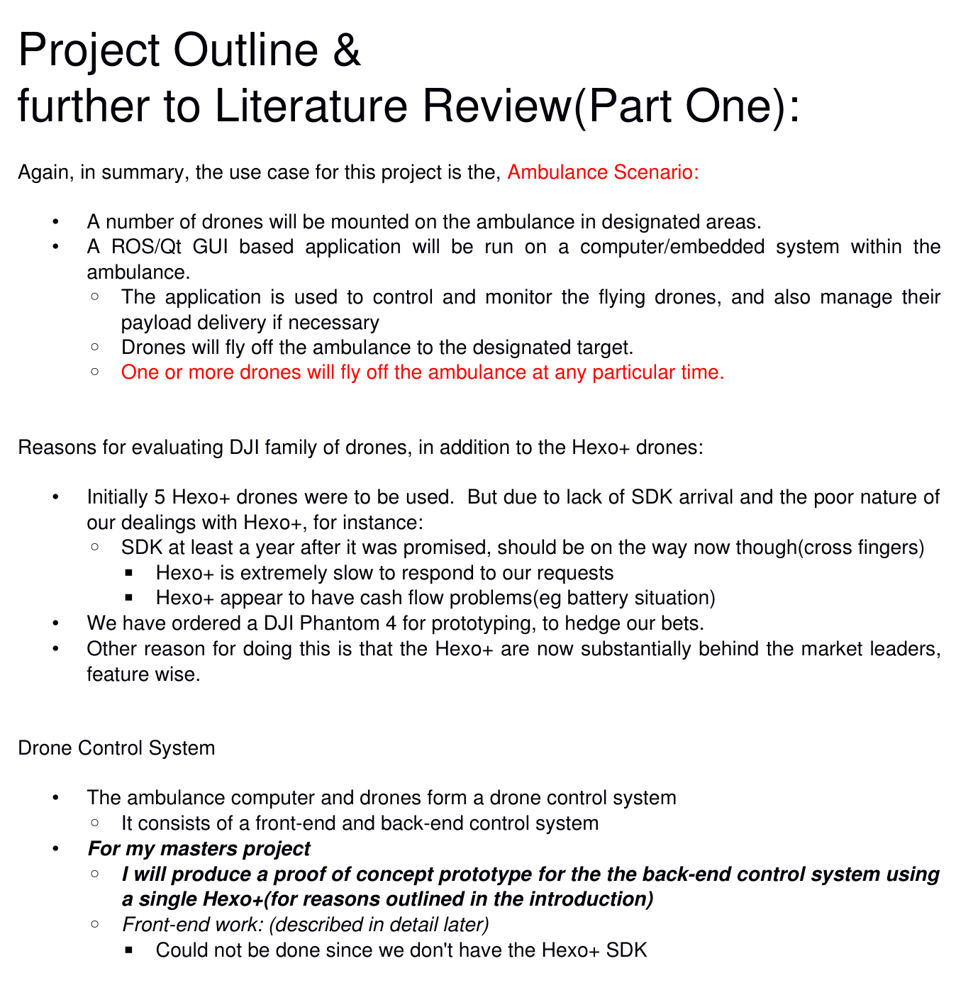

# proj30cp

This is the bulk of my masters 30cp project code, 2016, namely this is
for the backend control system of my project.

My  other  code   for  this  year  is  in   my  catkin.voice_node  and
rosVoiceNode(indigo) repositories.  They deal with chainging the voice
on a ros catkin and ros indigo system respectively.

## Project Description:

## See Code Summary below for code description only.

## Detailed description of project, see /report directory.

The following images are excerpts from the report:

#

#![image]images/backendContolsystemDiagram.png

#![image]images/backendControlSyetem2+3.png

#![image]images/froneEndControlSystemDiagram.FlightControlSystem.png

##Code Summary: 
arduino motor(servo &amp; stepper) wifi
servers(arduinoStepperServer.ino, arduinoServoServer.ino);
motor control client(motorControlClient.cpp &amp; xfer2as.cpp);
current state of gui.

#Code Details:
Arduino    motor,    servo     &    stepper,    WiFi    servers    are
arduinoServoServer.ino   &  arduinoStepperServer.ino.   The   code  is
currently  configured to  work with  a fixed/static  ip address  on my
mobile phone hotspot(to  facilitate easy demonstrations).  However, it
can easily  be configured for dhcp  and other static  ip addresses, it
invloves  changing  only  two  lines  of  code,  and  should  be  self
explanitory from the code itself and comments in the code.

Motor   control   client,   consists   of   motorControlClient.cpp   &
xfer2as.cpp.  xfer2as.cpp  is the library function clients  can use to
make a tcpip connection to the arduino server.  motorControlClient.cpp
tests out the client/server connections.

Current state/snapshot  of gui  code.  This code  includes sendSMS.cpp
which currently  sends an SMS succesfully, the  indicates 'Payload has
arrived.'.
